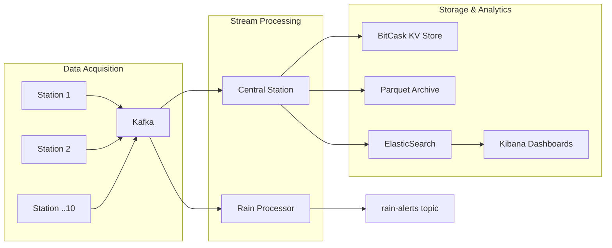
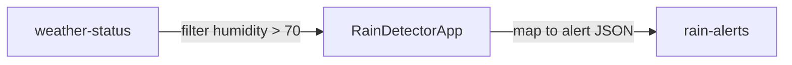
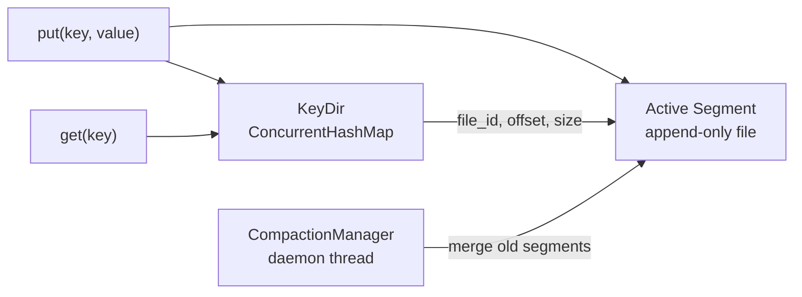
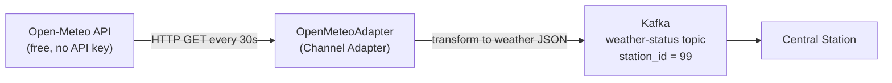
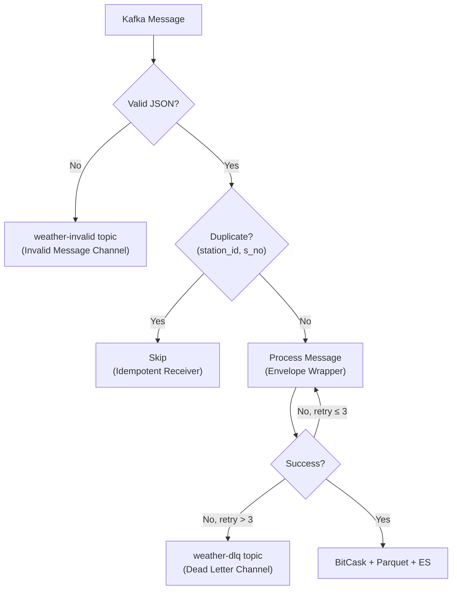

# Weather Monitoring System — Distributed Data-Intensive Application

A distributed IoT weather monitoring pipeline that collects readings from 10 simulated stations, streams them through Kafka, stores latest state in a custom BitCask KV store, archives history to Parquet files, and enables analytics via ElasticSearch/Kibana — all deployed on Kubernetes.



---

## 1. Project Structure

```
project/
├── weather-station/                 # Module A+B: Station mock + Kafka producer
│   ├── src/.../station/
│   │   ├── WeatherStationApp.java       # Entry point (1 msg/s loop)
│   │   ├── WeatherDataGenerator.java    # Random weather + battery 30/40/30 + 10% drop
│   │   └── KafkaWeatherProducer.java    # Kafka producer keyed by station_id
│   ├── Dockerfile
│   └── build.gradle
│
├── rain-processor/                  # Module C: Kafka Streams rain trigger
│   ├── src/.../rain/
│   │   └── RainDetectorApp.java         # Filter humidity > 70% → rain-alerts
│   ├── Dockerfile
│   └── build.gradle
│
├── central-station/                 # Module D: BitCask + Parquet + ES
│   ├── src/.../central/
│   │   ├── CentralStationApp.java       # Kafka consumer → BitCask + Parquet + ES
│   │   ├── bitcask/
│   │   │   ├── BitCaskStore.java        # KV facade: put/get/listKeys
│   │   │   ├── Segment.java             # Append-only binary data file
│   │   │   ├── HintFile.java            # Compact index for fast recovery
│   │   │   ├── KeyDir.java              # ConcurrentHashMap in-memory index
│   │   │   ├── CompactionManager.java   # Background segment merging
│   │   │   └── BitCaskTest.java         # 10-scenario test suite
│   │   ├── archiver/
│   │   │   ├── ParquetArchiver.java     # Batched Parquet writer (10K records)
│   │   │   └── WeatherRecord.java       # POJO for archiving
│   │   ├── elastic/
│   │   │   └── ElasticIndexer.java      # Real-time ES bulk indexer (30s flush)
│   │   └── api/
│   │       └── BitCaskServer.java       # HTTP API (Java HttpServer)
│   ├── Dockerfile
│   └── build.gradle
│
├── k8s/deployment.yaml              # Module F: 16-pod K8s manifest
├── deploy.sh                        # One-command deploy/teardown
├── bitcask_client.sh                # CLI for querying BitCask API
├── jfr_profile.sh                   # JFR profiling (local + K8s modes)
├── jfr_custom.jfc                   # Custom JFR recording settings
├── ingest_to_es.py                  # Parquet → ES batch ingestion
├── setup_kibana.sh                  # Kibana data view setup
├── docker-compose-elk.yml           # Local ES + Kibana stack
├── kibana_dashboards.ndjson         # Exported Kibana dashboards
├── build.gradle                     # Root Gradle build
└── settings.gradle                  # Multi-module config
```

---

## 2. Prerequisites

| Tool | Version | Purpose |
|---|---|---|
| Java JDK | 21+ | Compile and run (JDK, not JRE — needed for JFR) |
| Gradle | 8.7 | Build tool (wrapper included: `./gradlew`) |
| Docker | Latest | Container builds + local Kafka/ES |
| minikube | Latest | Local Kubernetes cluster |
| kubectl | Latest | K8s CLI |
| Python 3 | 3.10+ | ES batch ingestion script (optional) |

---

## 3. Module A+B — Weather Station Mock + Kafka Producer

### What It Does

Simulates 10 weather stations, each producing one JSON message per second to Kafka topic `weather-status`.

### Message Schema

```json
{
  "station_id": 1,
  "s_no": 42,
  "battery_status": "medium",
  "status_timestamp": 1700000000000,
  "weather": {
    "humidity": 65,
    "temperature": 28,
    "wind_speed": 12
  }
}
```

### Simulation Logic

| Feature | Implementation |
|---|---|
| **Battery distribution** | 30% `low`, 40% `medium`, 30% `high` — random roll per message |
| **Message drops** | 10% of messages silently dropped (never sent to Kafka). `s_no` still increments, enabling gap detection downstream |
| **Kafka keying** | `station_id` as Kafka key → same partition per station → preserves ordering |

### Environment Variables

| Variable | Default | Description |
|---|---|---|
| `STATION_ID` | `1` | Unique station identifier |
| `KAFKA_BOOTSTRAP` | `localhost:9092` | Kafka broker address |
| `TOPIC` | `weather-status` | Target Kafka topic |

### Verification

> **Prerequisite**: Kafka & ZooKeeper must be running. See [Step 1 in Running Locally](#step-1--start-kafka--zookeeper) for Docker commands.

```bash
# 1. Build
./gradlew :weather-station:shadowJar

# 2. Start one station
STATION_ID=1 java -jar weather-station/build/libs/weather-station.jar

# 3. Verify Kafka messages (separate terminal)
docker exec kafka kafka-console-consumer.sh \
  --bootstrap-server localhost:9092 --topic weather-status --from-beginning
```

| What to check | Expected |
|---|---|
| Messages appear in consumer | JSON with `station_id`, `s_no`, `weather` fields |
| `s_no` increments | Sequential, but with ~10% gaps (dropped messages) |
| `battery_status` values | Mix of `low`, `medium`, `high` |
| Rate | ~1 message per second (minus drops) |

---

## 4. Module C — Rain Trigger (Kafka Streams)

### What It Does

Kafka Streams application that filters `humidity > 70%` and publishes rain alerts.



### Alert Format

```json
{"station_id": 5, "humidity": 82, "message": "Rain detected at station 5"}
```

### Environment Variables

| Variable | Default | Description |
|---|---|---|
| `KAFKA_BOOTSTRAP` | `localhost:9092` | Kafka broker |
| `INPUT_TOPIC` | `weather-status` | Source topic |
| `OUTPUT_TOPIC` | `rain-alerts` | Alert destination |

### Verification

> **Prerequisite**: Kafka running + at least one weather station producing messages.

```bash
# 1. Build
./gradlew :rain-processor:shadowJar

# 2. Start rain processor (with stations already running)
java -jar rain-processor/build/libs/rain-processor.jar

# 3. Watch rain alerts (separate terminal)
docker exec kafka kafka-console-consumer.sh \
  --bootstrap-server localhost:9092 --topic rain-alerts --from-beginning
```

| What to check | Expected |
|---|---|
| Alerts appear | JSON with `station_id`, `humidity`, `message` |
| Humidity values | Always > 70 (filter is working) |
| Frequency | ~30% of messages (humidity range 1-100, so ~30% are > 70) |

---

## 5. Module D — Central Station

### D.1 BitCask KV Store (Custom Implementation)

A log-structured key-value store inspired by [Riak's Bitcask paper](https://riak.com/assets/bitcask-intro.pdf).



| Component | Class | Purpose |
|---|---|---|
| Data file | `Segment.java` | Append-only binary file, 16-byte header per entry |
| Memory index | `KeyDir.java` | `ConcurrentHashMap<key, (file, offset, size)>` |
| Recovery index | `HintFile.java` | Compact index for 10-100x faster startup |
| Background merge | `CompactionManager.java` | Merges inactive segments, keeping only latest value per key |
| Facade | `BitCaskStore.java` | `put()`, `get()`, `listKeys()`, rotation, recovery |

#### Optimizations

| Optimization | Impact |
|---|---|
| Pre-computed byte sizes in `Entry` | Eliminates redundant `String.getBytes()` during scanning |
| `FileChannel.force(false)` | Skips metadata fsync — 2-3x faster writes |
| `ConcurrentHashMap` for `KeyDir` | Lock-free concurrent reads from HTTP API |
| Background compaction on daemon thread | No blocking of reads/writes |
| Hint files | 10-100x faster recovery vs. scanning data files |

#### Testing

```bash
java -cp central-station/build/libs/central-station.jar \
  com.weathermon.central.bitcask.BitCaskTest
```

Runs 10 scenarios: basic ops, overwrite, recovery, rotation, compaction, concurrency, etc.

### D.2 Parquet Archiver

| Setting | Value |
|---|---|
| Batch size | 10,000 records |
| Compression | Snappy |
| Partitioning | By `station_id` |
| Output | `./data/archive/station_{id}/weather_{timestamp}.parquet` |

### D.3 Central Station App + HTTP API

| Endpoint | Method | Description |
|---|---|---|
| `/health` | GET | `{"status":"ok","keys":10}` |
| `/keys` | GET | List all station IDs |
| `/key/{id}` | GET | Latest data for one station |
| `/all` | GET | All stations' latest data |

### BitCask CLI Client

```bash
./bitcask_client.sh --view-all      # All stations
./bitcask_client.sh --view 3        # Station 3
./bitcask_client.sh --perf          # Performance test (100 iterations)
```

### Environment Variables

| Variable | Default | Description |
|---|---|---|
| `KAFKA_BOOTSTRAP` | `localhost:9092` | Kafka broker |
| `TOPIC` | `weather-status` | Input topic |
| `BITCASK_DIR` | `./data/bitcask` | BitCask storage |
| `ARCHIVE_DIR` | `./data/archive` | Parquet archive |
| `API_PORT` | `8080` | HTTP API port |
| `ES_HOST` | `elasticsearch-service:9200` | ElasticSearch host |
| `ES_INDEX` | `weather-status` | ES index name |

### Verification — BitCask

```bash
# Run the 10-scenario test suite
java -cp central-station/build/libs/central-station.jar \
  com.weathermon.central.bitcask.BitCaskTest
```

| Test Scenario | What It Validates |
|---|---|
| Basic put/get | Store and retrieve single value |
| Overwrite | Latest value wins |
| Multiple keys | Independent keys don't interfere |
| Missing key | Returns null, no crash |
| Persistence/recovery | Restart → data survives, rebuilt from hint files |
| Segment rotation | New segment when size threshold reached |
| Compaction | Old segments merged, stale values removed |
| Concurrent read/write | Thread-safe under parallel access |
| Large values | Handles big JSON blobs |
| Bulk operations | 1000+ keys performance check |

### Verification — Central Station + API

> **Prerequisite**: Kafka running (see [Running Locally](#step-1--start-kafka--zookeeper)).

```bash
# 1. Start central station
java -jar central-station/build/libs/central-station.jar

# 2. Start stations (wait 30s for data to flow)
for i in $(seq 1 10); do
  STATION_ID=$i java -jar weather-station/build/libs/weather-station.jar &
done
sleep 30

# 3. Query via CLI client
./bitcask_client.sh --view-all          # Should show 10 stations
./bitcask_client.sh --view 5            # Should show station 5 data

# 4. Query via HTTP API
curl localhost:8080/health               # {"status":"ok","keys":10}
curl localhost:8080/keys                 # ["1","2",...,"10"]
curl localhost:8080/key/3                # Latest JSON for station 3
curl localhost:8080/all                  # All 10 stations

# 5. Check Parquet files are being created
ls -la data/archive/                     # Should show station_* directories
```

---

## 6. Module E — ElasticSearch + Kibana

### Two Ingestion Methods

| Method | File | How It Works |
|---|---|---|
| **Real-time** (Java) | `ElasticIndexer.java` | Built into Central Station. Buffers messages, bulk-indexes to ES every 30s via `java.net.http.HttpClient`. Zero external dependencies |
| **Batch** (Python) | `ingest_to_es.py` | Reads Parquet files, bulk-indexes to ES. For backfill or re-indexing |

### Kibana Dashboards

Two dashboards are auto-imported by `deploy.sh` from `kibana_dashboards.ndjson`:

| Dashboard | Visualization | Expected Result |
|---|---|---|
| **Battery Status Distribution** | Pie chart on `battery_status.keyword` | ~30% low, ~40% medium, ~30% high |
| **Dropped Message Analysis** | Data table per station | ~10% drop rate per station |

#### Drop Rate Formula

```
Total Attempts = max(s_no) - min(s_no) + 1
Received      = count()
Dropped       = Total Attempts - Received
Drop Rate %   = (Dropped / Total Attempts) × 100
```

### Dashboard Export/Import

```bash
# Export from Kibana
curl -s -X POST "http://<KIBANA>/api/saved_objects/_export" \
  -H "kbn-xsrf: true" -H "Content-Type: application/json" \
  -d '{"type":["dashboard","index-pattern"],"includeReferencesDeep":true}' \
  -o kibana_dashboards.ndjson

# Import (done automatically by deploy.sh)
curl -s -X POST "http://<KIBANA>/api/saved_objects/_import?overwrite=true" \
  -H "kbn-xsrf: true" --form file=@kibana_dashboards.ndjson
```

### Verification

```bash
# On K8s:
KIBANA_URL="http://$(minikube ip):30561"
ES_URL="http://$(minikube ip):30920"

# 1. Check ES has data
curl "$ES_URL/weather-status/_count"     # {"count":N} where N > 0

# 2. Check ES index mapping
curl "$ES_URL/weather-status/_mapping" | python3 -m json.tool

# 3. Open Kibana dashboard
open "$KIBANA_URL"                       # Navigate to Dashboards → DDIA_Project

# 4. Verify battery distribution pie chart
#    → Should show ~30% low, ~40% medium, ~30% high

# 5. Verify dropped messages table
#    → Each station should show ~10% drop rate
#    → "Other" row should NOT exist (all 10 stations shown individually)

# Locally (with Parquet files):
pip install pyarrow elasticsearch
python3 ingest_to_es.py --archive-dir ./data/archive --es-host localhost:9200
./setup_kibana.sh
open http://localhost:5601
```

---

## 7. Module F — Docker + Kubernetes

### Dockerfiles

| Service | Base Image | Reason |
|---|---|---|
| `weather-station` | `eclipse-temurin:21-jre` | Slim JRE — no profiling needed |
| `central-station` | `eclipse-temurin:21-jdk` | Full JDK for JFR profiling |
| `rain-processor` | `eclipse-temurin:21-jre` | Slim JRE |

All use **multi-stage builds**: compile with JDK → run with JRE/JDK. Central station uses `exec java` so Java is PID 1 (required for `jcmd` JFR attach in containers).

### Kubernetes Deployment (16 Pods)

| Resource | Count | Image | NodePort |
|---|---|---|---|
| ZooKeeper | 1 | `bitnamilegacy/zookeeper:3.8` | — |
| Kafka | 1 | `bitnamilegacy/kafka:3.4` | — |
| Weather Stations | 10 | `weather-station:latest` | — |
| Rain Processor | 1 | `rain-processor:latest` | — |
| Central Station | 1 | `central-station:latest` | **30080** |
| ElasticSearch | 1 | `elasticsearch:8.13.0` | **30920** |
| Kibana | 1 | `kibana:8.13.0` | **30561** |

### Storage

| PVC | Size | Access | Used By |
|---|---|---|---|
| `shared-data-pvc` | 2Gi | ReadWriteOnce | Central Station (BitCask + Parquet) |
| `elasticsearch-pvc` | 5Gi | ReadWriteOnce | ElasticSearch index data |

### Verification

```bash
# 1. Deploy
./deploy.sh --build

# 2. Check all 16 pods are Running
kubectl get pods -n weather-monitoring
#   NAME                                 READY   STATUS    RESTARTS
#   central-station-xxx                  1/1     Running   0
#   elasticsearch-xxx                    1/1     Running   0
#   kafka-xxx                            1/1     Running   0
#   kibana-xxx                           1/1     Running   0
#   rain-processor-xxx                   1/1     Running   0
#   weather-station-1-xxx                1/1     Running   0
#   ... (10 stations)
#   zookeeper-xxx                        1/1     Running   0

# 3. Check central station logs
kubectl logs -f deploy/central-station -n weather-monitoring
#   Should show: "[Central] Processed X messages"
#   Should show: "[ES] Indexed Y documents"

# 4. Check BitCask API
curl "http://$(minikube ip):30080/health"
#   {"status":"ok","keys":10}

# 5. Check Kibana has dashboards
open "http://$(minikube ip):30561"
#   Navigate to Dashboards → DDIA_Project

# 6. Teardown
./deploy.sh down
```

---

## 8. Module G — JFR Profiling

### What It Does

Records a 60-second **Java Flight Recorder** session of the Central Station and extracts 4 required metrics.

### Custom Settings (`jfr_custom.jfc`)

The default JFR `profile` settings use high thresholds that filter out most events. Our custom settings explicitly enable:

| Event Category | Events Enabled | Threshold |
|---|---|---|
| Memory allocation | `ObjectAllocationInNewTLAB`, `ObjectAllocationOutsideTLAB`, `ObjectAllocationSample` | 300/s throttle |
| GC | `GarbageCollection`, `GCPhasePause`, `GCHeapSummary` | 0 ms |
| File I/O | `FileRead`, `FileWrite` | 0 ms |
| Socket I/O | `SocketRead`, `SocketWrite` | 0 ms |
| CPU + Threads | `CPULoad`, `ThreadStart`, `ThreadCPULoad` | 1s period |

### Running

```bash
./jfr_profile.sh k8s    # K8s: profiles running pod via jcmd (recommended)
./jfr_profile.sh         # Local: starts central-station with JFR flags
```

### 4 Required Metrics

| # | Metric | JFR Event | Sample Result |
|---|---|---|---|
| 1 | **Top 10 classes by memory** | `ObjectAllocationInNewTLAB` | `byte[]` (23), `ArrayList` (5), `ConcurrentLinkedQueue$Node` (4) |
| 2 | **GC pause count** | `GarbageCollection` | 1 event (G1 Young) |
| 3 | **GC max pause duration** | `GCPhasePause` | 6.03 ms |
| 4 | **I/O operations list** | `FileRead/Write`, `SocketRead/Write` | BitCask ~0.03ms/write, Kafka ~0.08ms/read |

### Output

| File | Description |
|---|---|
| `central_station_recording.jfr` | Raw JFR recording — open with JDK Mission Control (`jmc`) |
| `jfr_report.txt` | Parsed text report with all 4 metrics |

### Verification

```bash
# K8s mode (system must be deployed)
./jfr_profile.sh k8s

# Check report
cat jfr_report.txt
```

| What to check | Expected |
|---|---|
| Section 1: Memory | `byte[]` at the top (Kafka buffers + BitCask entries) |
| Section 2: GC count | Small number (1-5 events in 60s) |
| Section 3: GC max pause | < 50ms (system is healthy) |
| Section 4: File I/O | BitCask writes to `segment_NNNN.data` (~0.03ms each) |
| Section 4: Socket I/O | Kafka reads/writes to `kafka-service:9092` |
| Section 5: CPU | Low JVM usage (< 1%) — I/O bound, not CPU bound |

---

---

## Bonus — Open-Meteo Integration + Enterprise Integration Patterns

### Part 1: Open-Meteo Channel Adapter

Integrates with the [Open-Meteo](https://open-meteo.com/) free weather API to collect **real weather data** alongside mock stations.



| Feature | Details |
|---|---|
| **API endpoint** | `api.open-meteo.com/v1/forecast?current=temperature_2m,relative_humidity_2m,wind_speed_10m` |
| **Location** | Cairo (30.06°N, 31.25°E), configurable via env vars |
| **Station ID** | `99` (reserved for real data, distinguishable from mock stations 1-10) |
| **Poll interval** | 30 seconds |
| **Battery** | `N/A` (real data source, no battery simulation) |
| **Kafka integration** | Reuses existing `KafkaWeatherProducer` — same topic, same schema |
| **No API key needed** | Open-Meteo is free for non-commercial use |

#### EIP Patterns Implemented

| Pattern | How |
|---|---|
| **Channel Adapter** | Bridges external HTTP API to the Kafka messaging system |
| **Polling Consumer** | `ScheduledExecutorService` polls API at fixed 30s intervals |
| **Envelope Wrapper** | Raw weather data wrapped in metadata envelope (`station_id`, `s_no`, `timestamp`) |

#### Environment Variables

| Variable | Default | Description |
|---|---|---|
| `STATION_ID` | `99` | Station ID for real data |
| `KAFKA_BOOTSTRAP` | `localhost:9092` | Kafka broker |
| `TOPIC` | `weather-status` | Target topic |
| `LATITUDE` | `30.06` | Location latitude |
| `LONGITUDE` | `31.25` | Location longitude |
| `POLL_INTERVAL` | `30` | Seconds between API polls |

#### K8s Deployment

Runs as a separate pod reusing the `weather-station` image with a `command` override:

```yaml
command: ["java", "-cp", "app.jar", "com.weathermon.station.OpenMeteoAdapter"]
```

#### Verification

```bash
# Check adapter logs (K8s)
kubectl logs -f deploy/open-meteo-adapter -n weather-monitoring
# Should show: [OpenMeteo] Published s_no=1, s_no=2, ...

# Check data arrives in central station
curl "http://$(minikube ip):30080/key/99"
# Should return real Cairo weather data

# Locally (Kafka must be running)
STATION_ID=99 java -cp weather-station/build/libs/weather-station.jar \
  com.weathermon.station.OpenMeteoAdapter
```

### Part 2: Enterprise Integration Patterns (6 Patterns)

Six EIP patterns are implemented across the pipeline:



| # | Pattern | Location | Implementation |
|---|---|---|---|
| 1 | **Channel Adapter** | `OpenMeteoAdapter.java` | Bridges Open-Meteo HTTP API to Kafka messaging |
| 2 | **Polling Consumer** | `OpenMeteoAdapter.java` | `ScheduledExecutorService` polls API every 30s |
| 3 | **Envelope Wrapper** | All producers | Weather payload wrapped with metadata (`station_id`, `s_no`, `timestamp`) |
| 4 | **Invalid Message Channel** | `CentralStationApp` + `InvalidMessageHandler` | Malformed JSON → `weather-invalid` Kafka topic |
| 5 | **Dead Letter Channel** | `CentralStationApp` + `DeadLetterHandler` | Processing failure after 3 retries → `weather-dlq` Kafka topic |
| 6 | **Idempotent Receiver** | `CentralStationApp` + `IdempotentReceiver` | LRU cache of 10K `(station_id, s_no)` keys, duplicates skipped |

#### Pattern Files

| File | Pattern |
|---|---|
| `central-station/.../eip/InvalidMessageHandler.java` | Invalid Message Channel |
| `central-station/.../eip/DeadLetterHandler.java` | Dead Letter Channel |
| `central-station/.../eip/IdempotentReceiver.java` | Idempotent Receiver |

#### Verification

```bash
# 1. Deploy with EIP patterns
./deploy.sh --build

# 2. Check central station logs for EIP initialization
kubectl logs deploy/central-station -n weather-monitoring | head -20
# Should show:
#   [EIP] Invalid Message Channel → topic 'weather-invalid'
#   [EIP] Dead Letter Channel → topic 'weather-dlq' (max retries: 3)
#   [EIP] Idempotent Receiver initialized (capacity: 10000)

# 3. Check processing stats (after a few minutes)
kubectl logs deploy/central-station -n weather-monitoring | grep "Dupes skipped"
# Should show duplicate count (non-zero after Kafka rebalances)
```

---

## 9. Running Locally (Without K8s)

### Step 1 — Start Kafka & ZooKeeper

> No need to install Kafka locally — use the same Docker images as K8s:

```bash
docker network create weather-net

docker run -d --name zookeeper --network weather-net \
  -e ALLOW_ANONYMOUS_LOGIN=yes \
  -p 2181:2181 \
  bitnamilegacy/zookeeper:3.8

docker run -d --name kafka --network weather-net \
  -e KAFKA_CFG_ZOOKEEPER_CONNECT=zookeeper:2181 \
  -e KAFKA_CFG_LISTENERS=PLAINTEXT://:9092 \
  -e KAFKA_CFG_ADVERTISED_LISTENERS=PLAINTEXT://localhost:9092 \
  -e ALLOW_PLAINTEXT_LISTENER=yes \
  -p 9092:9092 \
  bitnamilegacy/kafka:3.4
```

Verify: `docker logs kafka 2>&1 | tail -3` → should show `started (kafka.server.KafkaServer)`

### Step 2 — Start ElasticSearch + Kibana (optional)

```bash
docker compose -f docker-compose-elk.yml up -d
# ES:     http://localhost:9200
# Kibana: http://localhost:5601
```

### Step 3 — Build All Modules

```bash
./gradlew shadowJar
```

Produces 3 fat JARs in `*/build/libs/*.jar`.

### Step 4 — Start the Pipeline

```bash
# Terminal 1: Central Station (start first)
ES_HOST=localhost:9200 java -jar central-station/build/libs/central-station.jar

# Terminal 2: Rain Processor
java -jar rain-processor/build/libs/rain-processor.jar

# Terminal 3: All 10 Weather Stations
for i in $(seq 1 10); do
  STATION_ID=$i java -jar weather-station/build/libs/weather-station.jar &
done
```

### Step 5 — Verify

```bash
./bitcask_client.sh --view-all               # 10 stations' latest data
curl localhost:8080/health                    # {"status":"ok","keys":10}
./setup_kibana.sh                            # Setup Kibana data view
open http://localhost:5601                    # Open Kibana dashboards
```

### Step 6 — JFR Profiling

```bash
./jfr_profile.sh                             # 60s recording → jfr_report.txt
```

### Step 7 — Stop Everything

```bash
kill $(jobs -p) 2>/dev/null                  # Stop stations
docker stop kafka zookeeper && docker rm kafka zookeeper
docker network rm weather-net
docker compose -f docker-compose-elk.yml down
```

---

## 10. Running with Kubernetes

### One-Command Deploy

| Command | Description |
|---|---|
| `./deploy.sh` | Build images (if needed), deploy 16 pods, import Kibana dashboards, print URLs |
| `./deploy.sh --build` | Force rebuild all Docker images |
| `./deploy.sh down` | Kill port-forwards, tear down everything |

### What `deploy.sh` Does

1. Verifies minikube is running
2. Builds Docker images inside minikube's Docker daemon (skips if images already exist)
3. Applies `k8s/deployment.yaml` (creates namespace + all resources)
4. Waits for all 16 pods to be ready
5. Imports `kibana_dashboards.ndjson` into Kibana
6. Prints access URLs using `minikube ip` + NodePorts

### Manual Deploy (Without deploy.sh)

```bash
minikube start
eval $(minikube docker-env)

# Build images inside minikube
docker build -t weather-station:latest -f weather-station/Dockerfile .
docker build -t central-station:latest -f central-station/Dockerfile .
docker build -t rain-processor:latest -f rain-processor/Dockerfile .

# Deploy
kubectl apply -f k8s/deployment.yaml
kubectl get pods -n weather-monitoring -w

# Access
echo "Kibana: http://$(minikube ip):30561"
echo "API:    http://$(minikube ip):30080/health"
echo "ES:     http://$(minikube ip):30920"
```

### Loading Pre-Built Images (Faster Than Building)

```bash
minikube image load weather-station:latest
minikube image load central-station:latest
minikube image load rain-processor:latest
minikube image load bitnamilegacy/kafka:3.4
minikube image load bitnamilegacy/zookeeper:3.8
minikube image load docker.elastic.co/elasticsearch/elasticsearch:8.13.0
minikube image load docker.elastic.co/kibana/kibana:8.13.0
```

### JFR Profiling on K8s

```bash
./jfr_profile.sh k8s    # Copies settings, records 60s, copies recording, generates report
```

### Useful Commands

| Command | Purpose |
|---|---|
| `kubectl get pods -n weather-monitoring` | Check pod status |
| `kubectl logs -f deploy/central-station -n weather-monitoring` | Watch central station logs |
| `kubectl logs deploy/weather-station-1 -n weather-monitoring --tail=5` | Check station output |
| `kubectl exec -it deploy/central-station -n weather-monitoring -- /bin/bash` | Shell into pod |

---

## 11. Design Decisions & Optimizations

### Kafka

| Decision | Rationale |
|---|---|
| `station_id` as Kafka key | Same partition per station → ordered messages → enables `s_no` gap detection |
| `auto.offset.reset=earliest` | Central Station processes all historical messages after restart |
| Kafka Streams DSL for rain processor | Declarative — no manual offset management |

### BitCask

| Decision | Rationale |
|---|---|
| `ConcurrentHashMap` KeyDir | Lock-free concurrent reads from HTTP API |
| Pre-computed byte sizes | Eliminates `String.getBytes()` calls during segment scanning |
| `channel.force(false)` | Skips metadata fsync — 2-3x faster |
| Background compaction daemon | Non-blocking; runs every 5 minutes |
| Hint files for recovery | Reads compact index instead of full segment scan |

### Parquet

| Decision | Rationale |
|---|---|
| 10K record batch size | Balance between memory and write efficiency |
| Snappy compression | Fast compress/decompress, ~50% size reduction |
| Partition by station_id | Efficient per-station queries |

### ElasticSearch

| Decision | Rationale |
|---|---|
| Bulk API (not per-document) | 10-100x fewer HTTP calls |
| 30s flush interval | Balance between freshness and efficiency |
| Retry failed batches | Re-adds to buffer for next cycle |
| `java.net.http.HttpClient` | Built into JDK — zero external dependencies |
| Dual ingestion (Java + Python) | Real-time for K8s, batch for historical data |

### Docker & K8s

| Decision | Rationale |
|---|---|
| Multi-stage Dockerfiles | Smaller runtime images |
| `imagePullPolicy: Never` for custom images | Uses locally-built images, no Docker Hub |
| `exec java` in entrypoint | Java as PID 1 → `jcmd` JFR attach works |
| Full JDK for central-station | JRE lacks `jcmd` for JFR profiling |
| `bitnamilegacy` images | Compatibility with existing environment |
| NodePort services | Direct browser access without port-forwarding |
| `deploy.sh` with build caching | Skips rebuild if images exist; `--build` to force |

### JFR

| Decision | Rationale |
|---|---|
| Custom `.jfc` settings | Default `profile` has high thresholds — misses most events |
| 0ms thresholds for I/O and GC | Captures every operation |
| Both local and K8s modes | Flexible profiling in any environment |
